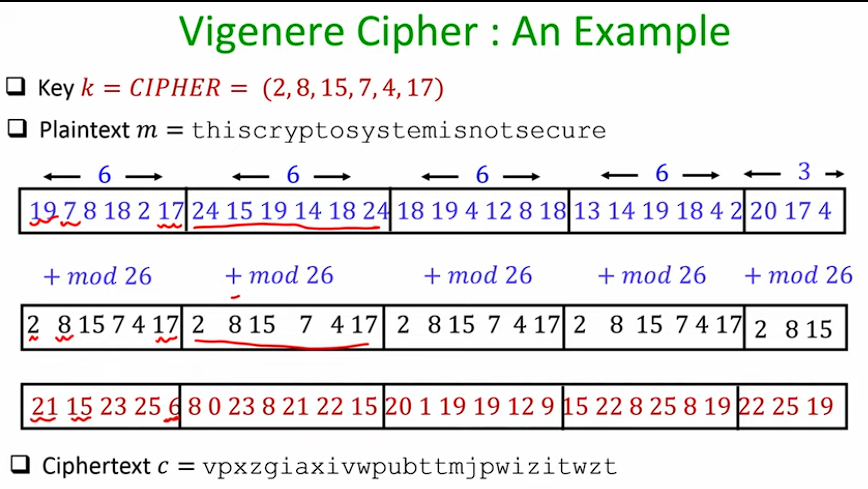

# Symmetric-key Encryption algorithm

The key is __magically__ shared yo both parties. The algorithm ensure that the message is not intercepted. 
Maintains:

- Privacy : That the message is not understandable to third parties
- Integrity : That the message is not intercepted in channel
- Authenticity : That the message is from correct party

---

## Steps of Symmetric-key encryption

1. `Gen() -> k` 
    <u>Key</u> is randomly generated from seeds
<br/>
2. `Enc(m, k) -> c`
    The encoder returns the cypher text <u>randomly</u>
<br/>
3. `Dec(c, k) := m`
    The decoder returns the message text <u>deterministically</u>

---

## Properties expected from a Secure Cypher

1. Correctness : `for every k ∈ K and m ∈ M`
     ➜ Dec<sub>k</sub>(Enc<sub>k</sub>(`m`)) := `m`

2. Privacy : cyphertext `c` should not reveal anything about `m`

---

### Definition of Secure Encryption

If cyphertext does not help to compute any function of the underlying plaintext.

Loopholes:

- How to mathematically formalize this definition
- What is the underlying attack model ?
- Does the attacker has any "additional information" ?

---
---

## Attack Models

1. Cyphertext-only attack (COA)
2. Known plaintext attack (KPA)
3. Chosen plaintext attack (CPA)
4. Chosen cyphertext attack (CCA)

\<Goal> <u>Compute the underlying plaintext</u> \</Goal>

---

### 1. Cyphertext-only attack (COA)

`GIVEN:` Attacker has access to cyphertext(s) only.

$$ {(c_i) : c_i\leftarrow Enc_k(m_i) }$$

`GOAL:` Find underlying function of cyphertext

### 2. Known plaintext attack (KPA)

`GIVEN:` Attacker has access to `(m, c)` pairs under the same unknown key.

eg: First word of an email is usually "Hello".

$$ {(m_i,c_i) : c_i\leftarrow Enc_k(m_i) }$$

`GOAL:` Find underlying function of plaintext in a new cyphertext

### 3. Chosen plaintext attack (CPA)

`GIVEN:` Attacker has access to `encryption oracle` service ➜ active attack.

- Gets encryption of plaintext of attackers choice without knowledge of sender/receiver.
- `(m, c)` pairs available. `m` is now under-control of attacker

$$ {(m_i,c_i) : c_i\leftarrow Enc_k(m_i)\,|\,m\,is\, controlled\,by\,attacker}$$

`GOAL:` Find underlying function of plaintext in a new cyphertext.

### 4. Chosen cyphertext attack (CCA)

`GIVEN:` Attacker has access to `encryption oracle` service and `decryption oracle` service.

- Gets encryption of plaintext of attackers choice.
- Gets decryption of cyphertext of attacker choice.

$$ {(m_i,c_i) : c_i\leftarrow Enc_k(m_i)\,|\,m\,is\, controlled\,by\,attacker}$$

$$ {(m_i,c_i) : c_i\leftarrow Dec_k(c_i)\,|\,c\,is\, controlled\,by\,attacker}$$

Note: All enc and dec are done under same key `k`.

`GOAL:` Find underlying function of plaintext in a new cyphertext.

---

### Kerckhoff's Principle

"A crypto-system should be secure even if everything about the system, except the `key` is public knowledge."

➜ Enc and Dec algorithms are publicly available to sender/receiver/attacker.

- Maintaining privacy of key is relatively easier.
- Easy to replace a key.
- Infeasible to have different algorithms for every pair of parties.
- Publicly available mean public can scrutinize the algorithm to make it better or find flaws.

---

## Shift Cypher

Plaintext and cyphertext characters ∈ {a,...,z}.

`Enc:` shift each character `k` position "forward"
`Dec:` shift each character `k` position "backward"

### Mathematical interpretation:

let {a,...,z} as {0,...,25}

- K = {0,...,25}
- M = C = {0,...,25}

$$GEN: k \in_R \mathbb{K}\,|\,R\,is\,random$$

$$ENC: c_i := (m_i+k)\,mod(26)$$

$$DEC: m_i := (c_i-k)\,mod(26)$$

### Security

`Attack: COA`

- Brute-force attack: Decrypt `c` with all possible value of `k`. Since, only 26 candidate keys.

###### Hence, a sufficient-key space is required.

---

## Mono-alphabetic substitution cypher

➜ Mapping of characters in one-to-one fashion.

`Key: A secret permutation`

$$\mathbb{K} \in 26!$$

Hence, Brute-force unavailable !

### Frequency analysis attack:

_(applicable with natural language)_

Idea: Exploit the redundancy present in underlying natural language.

Eg: Character Frequency of `E` is greater then the rest.
Eg: Average Bigram frequency of `TH` is greater than rest.
Eg: Trigram: `THE,ING,AND,HER...`

- Which cyphertext character occurs most frequently will highly be character `E` 
- Similarly for two character bigrams `TH`. 

---

## Ploy-alphabetic Substitution (Vigenere) Cypher

Idea: Multiple instances of of shift cypher

Instead of a __single character__ key. We use a __word__ key of length `t`.

Eg:



### Cryptanalysis of vigenere cypher

Stage 1 : Determine the length of `t`
    Kasiski's method, Index of coincidence method
Stage 2 : Determine the characters of `k` (k<sub>1</sub>,k<sub>2</sub>,k<sub>3</sub>,...k<sub>t</sub>).

#### Kasiski's method

- If a repeated substring in a plaintext is encrypted by the same substring in the keyword, then the ciphertext contains a repeated substring and the distance of the two occurences is a multiple of the keyword length.
- Not every repeated string in the ciphertext arises in this way; but, the probability of a repetition by chance is noticeably smaller.

```
Plaintext   ......THE................THE.....................NIJ...........
Keyword     ......ION................ION....................IONI...........
Ciphertext  ......BVR................BVR.....................BVR...........
```

Eg:
__M :__ There are two ways of constructing a software design: One way is to make it so simple that there are obviously no deficiencies, and the other way is to make it so complicated that there are no obvious deficiencies. The first method is far more difficult.
__K :__ SYSTEM `(t=6)`

    [THERE ARE]TW OWAYS OFCON STRUC TINGA SOFTW AREDE SIGNO NEWAY
    [SYSTE MSY]ST EMSYS TEMSY STEMS YSTEM SYSTE MSYST EMSYS TEMSY
    [LFWKI MJC]LP SISWK HJOGL KMVGU RAGKM KMXMA MJCVX WUYLG GIISW

    ISTOM AKEIT SOSIM PLETH AT[THE REARE] OBVIO USLYN ODEFI CIENC
    STEMS YSTEM SYSTE MSYST EM[SYS TEMSY] STEMS YSTEM SYSTE MSYST
    ALXAE YCXMF KMKBQ BDCLA EF[LFW KIMJC] GUZUG SKECZ GBWYM OACFV

    IESAN DTHEO THERW AYIST OMAKE ITSOC OMPLI CATED THAT[T HEREA
    EMSYS TEMSY STEMS YSTEM SYSTE MSYST EMSYS TEMSY STEM[S YSTEM
    MQKYF WXTWM LAIDO YQBWF GKSDI ULQGV SYHJA VEFWB LAEF[L FWKIM

    RE]NOO BVIOU SDEFI CIENC IESTH EFIRS TMETH ODISF ARMOR EDIFF
    SY]STE MSYST EMSYS TEMSY STEMS YSTEM SYSTE MSYST EMSYS TEMSY
    JC]FHS NNGGN WPWDA VMQFA AXWFZ CXBVE LKWML AVGKY EDEMJ XHUXD

    ICULT
    STEMS
    AVYXL

The plaintext string `THEREARE` appears three times at positions 0, 72 and 144. The distance between two occurences is 72. The repeated keyword and ciphertext are SYSTEMSY and LFWKIMJC, respectively. Therefore, these three occurences are not by chance and 72 is a multiple of the keyword length 6.

#### Frequency analysis

$$m_1\hspace{1cm} m_{1+t}\hspace{1cm} m_{1+2t}\hspace{1cm}m_{1+3t}\hspace{1cm}m_{14t}$$

$$\downarrow k_1\hspace{1cm}\downarrow k_1\hspace{1cm}\downarrow k_1\hspace{1cm}\downarrow k_1\hspace{1cm}\downarrow k_1$$

$$c_1\hspace{1.2cm} c_{1+t}\hspace{1.2cm} c_{1+2t}\hspace{1.2cm}c_{1+3t}\hspace{1cm}c_{14t}$$

Eg:
Since, t = 6, from the above text:
```
T .....R .....A .....O .....C .....S .....R
k1.....k1.....k1.....k1.....k1.....k1.....k1
L .....J .....S .....G .....U .....K .....J
```
Since, this problem is now a simple shift cypher problem, we can break this with brute-force attack.

$int(J) - int(R) = 8 = k_1$

---

## Perfect Security

`Attack Model: COA`

`Adversry is computationally unbounded`

<b>Cyphertext `c` should not leak any addtional information about plaintext `m`.</b>

1. Probability distribution on $\mathbb{K} :$ Almost always a unifrom distribution.
$$P[\mathbf{K} = k] := \frac{1}{\vert k \vert}$$

2. Probability distribution on $\mathbb{M} :$ Induced by the priot-information about the plaintext.
eg: P(m = "attack") = 0.7 or P(m = "retreat") = 0.3
$$P[\mathbf{M} = m] := m$$

3. Probability distribution on $\mathbb{C} :$ Determined by probability distribution over $\mathbf{M, K}$ and steps of Enc.
$$P[\mathbf{C} = c] := c$$

---

### Mathematical defination

$$P[\mathbf{M} = m \vert \mathbf{C} = c] = P[\mathbf{M} = m]\,\,\forall\,P\,over\,\mathbf{M,K}$$

<b>Probability of guessing the plaintext does not change even after knowing the probabilty of cyphertext.</b>

#### Alternate definations

1. $$P[\mathbf{C} = c \vert \mathbf{M} = m_0] = P[\mathbf{C} = c \vert \mathbf{M} = m_1]$$

Probabily of guessing cyphertext is same for all message. (Independence of cyphertext distribution)

2. __Defined as Challenge Response Game__

Publicly Known: $\Pi = (Gen, Enc, Dec),\mathbb{M}$

__agent1:__ Computaionally Unbounded Attacker $\mathcal{A}$
__agent2:__ Hypothetical Vertifer

##### Experiment = $\Large PrivK_{\mathstrut\mathcal{A},\,\Pi}^{eav\mathstrut}$

- $PrivK$ means Private Encryption or Symmetric Key encryption process

- $eav$ means only to eavsdrop meaning COA attack model

###### Process:

1. $\mathcal{A}$ will send a random pair of messages to the verifier. $$(m_0, m_1) \in \mathbf{M},\,|m_0| = |m_1|$$
2. Verifier is randomly take one message $m_0\,or\,m_1$ with probablity of $b \leftarrow\{0,1\}$
3. Verifier encrypts the message with key $k$ $$c \leftarrow Enc_k(m_b)$$
4. $\mathcal{A}$ will prediction $b' \in \{0,1\}$ to verifier

###### Output:

- 1 , if $b = b' \to$ Attacker has identified the message correctly
- 0 , if $b \not ={b'} \to$ Attacker has incorrectly identified the message

$\Pi = (Gen, Enc, Dec)\,over\,\mathbf{M}$ is perfectly-indistinguishable i.e. __Perfect Security__, if for every $\mathcal{A}$ $$P [PrivK_{\mathstrut\mathcal{A},\,\Pi}^{eav\mathstrut} = 1] = \frac{1}{2}$$
Probabilty of success is $\small 1/len(\mathbf{M})$ or uniform distribution.

---

### Proof : Vigenere Cypher is Not perfectly-secure

`t` can be 1 or 2

$\mathbf{M} = \mathbf{C} = \{0,1,...,25\}^2$

Gen outputs a unifrom random $t \in \{1,2\}$ and random key $k \in \{0,1,...,25\}^t$

1. $\mathcal{A} : m_0 = 00, m_1 = 01$ 
2. Verifier randomly picks a message and encrypts with key $k$. 
3. $Verifier : c = (c_1, c_2) \leftarrow Enc_k(m_b)$
4. $\mathcal{A} : \LARGE\frac{b' = 0,\,\,if\,c_1 = c_2}{b' = 1,\,\,if\,c_1 \not ={c_2}}$

#### Claim:

$P [PrivK_{\mathstrut\mathcal{A},\,\Pi}^{eav\mathstrut} = 1] = 0.75$

1. $\small P [PrivK_{\mathstrut\mathcal{A},\,\Pi}^{eav\mathstrut} = 1] = \frac{1}{2}.P[\mathcal{A} \,outputs\,b'=0\,| \,b=0] + \frac{1}{2}.P[\mathcal{A} \,outputs\,b'=1 \,| \,b=1]$
<br/>

2. $\small P[\mathcal{A} \,outputs\,b'=0\,| \,b=0] = \frac{1}{2}.P[key\,is\,of\,period\,1] + \frac{1}{2}.P[key\,is\,of\,period\,2\,with\,both\,characters\,being\,the\,same]$
<br/>

- $\small P[key\,is\,of\,period\,1] = 1 : \,\,\, as \,\, m_0 = 00, then \,(c_1,c_2) = (k,k) $ 


- $\small P[key\,is\,of\,period\,2\,with\,both\,characters\,being\,the\,same] = \frac{1}{26} : \,\,\, as \,\, m_1 = 01, then \,(c_1,c_2) = (k_1,k_2).\, P[k_1] = 1 \,and\,P[k_2]=\frac{1}{26}.$ 

<br/>

- $\small P[\mathcal{A} \,outputs\,b'=0\,| \,b=0] = \frac{1}{2} + \frac{1}{2}.\frac{1}{26}$

<br/>

3. $\small P[\mathcal{A} \,outputs\,b'=1\,| \,b=1] = 1 - P[\mathcal{A} \,outputs\,b'=0\,| \,b=1] $
<br/>

- $\small P[\mathcal{A} \,outputs\,b'=0\,| \,b=1]  = P[period=2, \,with \,first \,character \,being \,one \,more\, than \,second]$
- $\small eg: 01 + 10/21/32... mod(2) \to Then \,the\, output \,will \,be\,00.$

- $\small P[\mathcal{A} \,outputs\,b'=0\,| \,b=1]  = \frac{1}{2} . \frac{1}{26}$

<br/>

- $\small P[\mathcal{A} \,outputs\,b'=1\,| \,b=1] = 1 - \frac{1}{2}.\frac{1}{26}$

<br/>

4. $\small P [PrivK_{\mathstrut\mathcal{A},\,\Pi}^{eav\mathstrut} = 1] = \frac{1}{2}.(\frac{1}{2} + \frac{1}{2}.\frac{1}{26} + 1 - \frac{1}{2}.\frac{1}{26}) = \frac{3}{4}$

5. $\small P [PrivK_{\mathstrut\mathcal{A},\,\Pi}^{eav\mathstrut} = 1] \not ={\frac{1}{2}} $

Hence, not perfectly secure !

---

## Vernam Cypher (One-time pad encryption)

$$\mathbb{M} = \mathbb{K} = \mathbb{C} = \{0,1\}^l$$

`GEN:` uniformly random $l$-bit key | Randomized
`ENC` $c := m \oplus k$ | Deterministic | Masking
`DEC` $m := c \oplus k$ | Deterministic | Un-Masking

### Proof : Vernam Cypher is perfectly-secure

$P[\mathbb{C} = c | \mathbb{M} = m_0] = P[\mathbb{K} = m_0 \oplus c] = c^{-l}$
$P[\mathbb{C} = c | \mathbb{M} = m_1] = P[\mathbb{K} = m_1 \oplus c] = c^{-l}$

Since, taking $m_0$ and $m_1$ does not give any new information about $c$ 
$P[\mathbb{C} = c | \mathbb{M} = m_0] = P[\mathbb{C} = c | \mathbb{M} = m_1]$

### Limitations:

1. Key `k` should be large as plaintext `m`
eg: File = 1GB needs Key = 1GB

2. Key cannot be used to encrypt more than one message
Fresh key for each instance of encryption

---

## Limitations of Perfectly-Secure Cypher

1. Key should be large as plaintext.
   $$|\mathbb{K}| \geq |\mathbb{M}|$$
2. Key should not be used to encrypt more than one message.